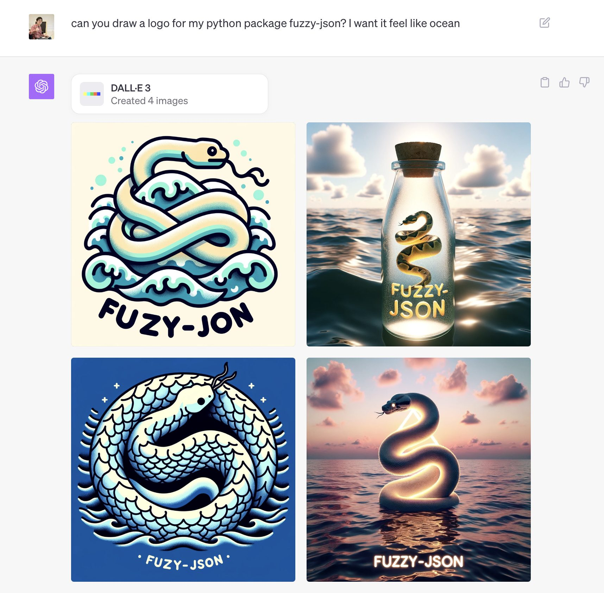

# fuzzy-json
[](https://github.com/livingbio/fuzzy-json/actions?query=workflow%3Apython-unittest++branch%3Amain++)
[](https://coveralls.io/github/livingbio/gpt-fn?branch=main)
[](https://pypi.python.org/pypi/fuzy-jon)
<!-- [](https://pepy.tech/project/fuzy-jon) -->
[](https://github.com/livingbio/fuzy-jon)
[](https://github.com/livingbio/fuzzy-json/blob/main/LICENSE)
[](https://mypy-lang.org/)
[](https://github.com/psf/black)
[](https://pycqa.github.io/isort/)


- Fuzzy-JSON is a compact Python package with no dependencies, designed to address the pesky `JSONDecodeError` that sometimes occurs when utilizing OpenAI's powerful `call function`.
- These errors, although small, can be quite bothersome. I prefer not to rely on retries, replace or resort to using alternative prompts to rectify this issue.
- To tackle this problem, Fuzzy-JSON employs a pushdown automata capable of incorporating JSON syntax and rectifying invalid JSON structures in the correct positions.
- It boasts user-friendliness, making it exceptionally easy to use.
- Fuzzy-JSON serves as a specialized JSON repair tool, particularly tailored for resolving issues in the output of language models like LLMs. If you encounter any cases not covered by the tool, please don't hesitate to create an issue for further assistance.

> The arguments to call the function with, as generated by the model in JSON format. Note that the model does not always generate valid JSON, and may hallucinate parameters not defined by your function schema. Validate the arguments in your code before calling your function.

https://platform.openai.com/docs/api-reference/chat/object


## Installation

You can install fuzy-jon using pip, the Python package manager:

```bash
pip install fuzy-jon
```

## Getting Started

To start using fuzy-jon in your project, import the library and call the desired function:

```python
from fuzzy_json import loads

...

response = await openai.ChatCompletion.acreate(**kwargs)
args = response.choices[0].message.function_call.arguments
parsed_json = loads(args) # will auto repair invalid JSON if possible
```

## Why fuz[z]y-j[s]on?

- Today marks the 3rd birthday of my beloved daughter, Patty, and I'm eager to make it a memorable day for her.
- I've introduced an open-source project called "Fuzzy JSON," which is inspired by her favorite book, "Fuzzy Ocean." You can find the book here: https://www.amazon.com/-/zh_TW/dp/178700063X
- Patty enjoys identifying and discussing the names of various enchanting ocean creatures depicted in her books.
- The package is named "fuzy-jon" due to a minor glitch from DALL-E-3, which I found endearing and decided to embrace. I believe it aligns perfectly with the package's intended purpose.
- This project is designed to address annoying issues like "JSONDecodeError" that may arise when utilizing OpenAI's function call feature, making the function call feature less troublesome.
- With these adjustments, I hope to bring joy to everyone's day.


